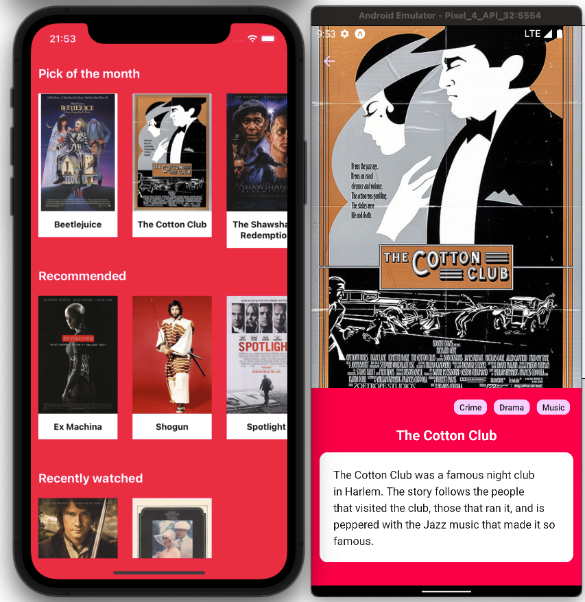
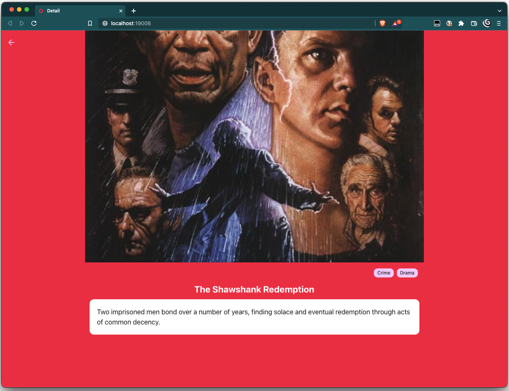

# 24i ReactNative code assigment

Purpose of this project is to fulfil code assigment described in [this document](./assets/code-assigment.pdf).

Application is build via [Expo](https://expo.dev/), written in [TypeScript](https://www.typescriptlang.org/) 
and utilizes [react-navigation](https://reactnavigation.org/), [React Query](https://react-query-v3.tanstack.com/) 
and [NativeBase](https://nativebase.io/).

Application targets iOS, Android and web.

## Installation

1. Clone the repository.
2. Run `yarn install`.
3. Run `yarn start` and follow given instructions.

## Possible improvements

- Use [Detox](https://github.com/wix/detox) for E2E testing.
- Improve caching policy e.g. by observing when application is brought to foreground. 
- Improve data validation with e.g. [Zod](https://github.com/colinhacks/zod).
- Lazy loading of images.
- Localization of texts.
- Lots of visual and UX improvements
  - Image placeholder for "not yet loaded" images
  - Background for back icon on detail page
  - Web carousel ergonomics

## Screenshots

### Mobile 

### Web

## Author
Jiří Bažant - [bazant.dev](https://bazant.dev)

## Licence
MIT